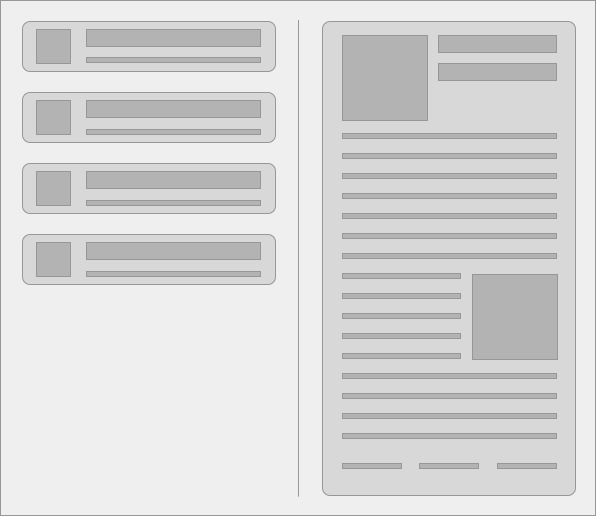

## Coding Challenge

### The Idea

The purpose of this challenge is to give us an idea about your coding skills.

At XING we value well structured and tested code. Semantic HTML, modern and responsive CSS, a consistent coding style and a structured workflow are important to us.

### Challenge

You build a ReactJS application which contains a list and a detail view of eg. messages, a to-do-list, bookmarked articles.
Start with `create-react-app`(https://github.com/facebook/create-react-app). Please do the layout and styling with your own css. Don't use any component libraries like bootstrap or material-ui.

- Total working time should not be more than 6 hours
- Please don't use something you already developed
- Document your code (see below)
- Please use separate branches for part 1 and part 2

#### Task - Part 1

In this task we like to see how you write your frontend code. Keep it simple and don't use any external API. You can iterate on that feature in the second part of the coding challenge.
The application should be somewhat pleasant to look at and responsive.

1. Create a page with two sections.
2. In one section you have a list of items (min. 2 items) with a little preview of the content.
3. In the other section there's a detail view of the selected item.
4. When you click on one of the items in the list, the content is shown in the other section.
5. Use your own mock data.

This is the base for the second part.

#### Task - Part 2

It's your turn now! Show off your coding skills and extend the application.
Come up with your own idea or take some inspiration from these examples:

- CSS animations
- filter functionality for the list view
- mark an item as read
- data manipulation
- use a public API instead of mock data (eg. https://github.com/toddmotto/public-apis)
- Add more pages by using routes
- fully accessible with tabs and screen readers
- etc.

### Notes

- We'd like to see how familiar you're with React and React features.
- If you think you'll need another framework please explain shortly in the documentation section.
- Testing your code is important, we'd like to see some tests (full coverage not required).

### Documentation

Use this readme to document what you've built.
Make sure that the person that reviews this code understands your choices and limitations.

- Describe what you've built. A screenshot is always nice.
- Commit messages are also some kind of documentation.
- Outline your reasoning behind technical choices (architecture, third party libs, React features, etc.)
- Explain technical trade-offs
- Anything you skipped due to time constraint?
- What would you add if you had additional time for this project?

Happy coding & good luck! 🚀

---

## Candidate's doc

_Please provide your documentation and outline your choices._

I enjoy reading good comic books. But nowadays it is very hard to find them without visiting a comic book store. So I built a "Comic Book Adviser" that can give you fresh inspiration, on the go.

The app is devided into a list and a detail section.
Both are resizing depending on the width of the screen.
Mayor break points are

- at 550px for smartphones in portrait mode and
- at 860px for tablets or smartphones in landscape mode

I decided to start with the following layouts from here:

A one column Design for small screen-sizes with a modal view for the details.

Maximizing the screen real estate for this visual medium. I am a typical 'one hand smartphone user', so I optimzed the button locations for maximum thumb-friendliness (for a right handed person for now).

A two columns 50/50 design, that focuses on the comic book covers with a list and a detail view for bigger Devices.

A two column 33/66 design that gives even more space for details and the selected cover at one glance on 'desktop screens.'

The brilliance of the colors, the art and the minimalism of the surrounding application was a strong reason for the different decisions during the two parts.

Here is an outline of my thoughts and reasoning behind the tasks that I did during PART 1 and 2.

### Part 1

- first structural prototype on paper and with raw HTML
- building components out of the obvious building blocks
- introducing semantic HTML
- focusing early on tests
- creating a validator/serializer to keep the 'circle of trust' as clean as possible
- trying out different worklflows for using React, as it is fairly new to me (CRA was a great help)
- focusing on readability by destructuring the props and keeping complexity down
- introducing a minimal 'comic book style' design to enhance the experience
- utilizing flexbox for speed and realiability, because using a framework would have been way to much overhead for a simple view like this one
- adjusting tests and optimizing data validation while trying to focus on the minimalistic visuals, so that the comic book covers can shine

### Part 2

- adding the external API to the mix. Here I used one of the few dependencies outside of 'create-react-app'. I decided to go with axios. The request that this app does are limited to one GET call, which could have been done with `fetch` as well.
- This is a client side app with a public key: Authentication is done by Marvel via CORS. Please let me know which hosts I should register for you in the Developer Portal (deniz.okcu@gmail.com). Requests are limited up to 3000/day. For now `localhost` works: Starting the app with `yarn start` from your local machine should give you access to the endpoint.
- adding more 'app like feel' on mobile devices by adding animations for the detail view in portait mode.
- adding more engagement with a call to action button to restart the the randomly generated request. I tried out using react-router-dom, but decided against it, to keep the complexity as low as possible while time is a contraint. I clearly know it is bad practice, to let the browser reload the full app, while react is optimized to just refresh the changed nodes!
- adding a link into the Comic knowledgebase or the shop depending on availability

Surprisingly, I enjoyed the app the most in portrait mode on a smartphone. You should definitly connect to you computer via wifi and try it out!

---

## 

## 

## 

## 

---

### Tests and Folder Structure

After looking into different test frameworks I decided to test the components with snaphots tests (jest + enzyme). The serializer is one possible example for a unit test.

Having a non-opinionated library helps with flexibility, but leaves also space for discussions: For the folder structure I opted for

- one folder for components, where most of the components have one additional .css and .test file.
- one folder for data (Part 1: mock data, part 2: test data)
- one folder for utilities and
- one folder for configuration

The size of the app will decide how far this is future proof.

### What I left out (but would have loved to continue - in no particular order):

- adding routes and more pages
- adding more gamification, like a view list of collectable book covers or bookmarks
- making the pages sharable and deterministic by putting ids into the url
- adding an entry page where you can enter any numkber that will have an effect to the results
- a neural network that helps findeng better results (synaptic.js is amazing)
- adding a request service for better code structure
- adding a storage service to cache the requests locally
- refining the overall appeareance and accessability
- better tests
- react hooks
- use prop-types
- use validation library like Joi

### Risks and Limitations

I am aware, that it was a big risk to go into an important task like this, with no day-to-day experience with React. This is no excuse! It just showed me again, how effective 'learning by doing' is. I belive I haven't learned as much during the last months as I have in the last days. My biggest limitation was clearly the missing experience.

I am very grateful for this opportunity. And I am looking forward to talk to you soon.
Let me know if anything is not clear. I will try my best.

Cheers, Deniz
